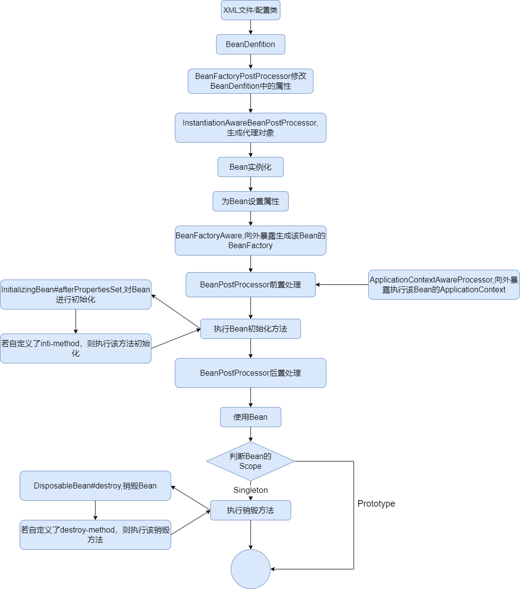

# MySpring
该项目为学习过Spring源码后，对Spring的一个简单实现。

实现了IOC,AOP，应用上下文，Bean生命周期等功能。

## IOC

### Bean生命周期

### 循环依赖

使用三级缓存解决循环依赖问题。解决一个问题需要知道问题是如何产生的，循环依赖问题是因为两个Bean互相引用，导致在创建Bean的过程中无限重复创建，导致暴栈。解决该问题，只需要将Bean提前暴露，消除两个Bean在互相引用后产生的无限创建即可。

一级缓存为SingletonObjects，用于最终存放单例Bean，

二，三级缓存用于真正解决循环依赖问题，每次实例化一个Bean时会将该Bean存入三级缓存中。

当发生循环依赖时会先判断该Bean是否存在于三级缓存中，没有则创建，有则将该Bean从三级缓存中加入到二级缓存中，并删除三级缓存的Bean，然后将该Bean作为结果返回，赋值给引用该Bean的Bean即可。

### ApplicationContext

提供了解析XML配置文件和解析配置类，两种应用上下文。

* 解析XML配置文件的ApplicationContext，会将XML文件进行解析，将里面带有bean标签的对象，注册为BeanDenfition，同时提供了context-scan标签，对某一个包进行扫描，将有Component注解的类进行注册。
* 配置类ApplicationContext则是会在类上加上一个ComponentScan注解，将该注解指定的包进行扫描，扫描所有有Component注解的类注册为BeanDenfition。

Component注解可以为Bean指定名称，同时还实现了Value注解，为Bean内的属性进行赋值。

## AOP

通过AOP实现了三种通知类型接口（MethodBeforeAdvice，MethodAfter，Advice，MethodAroundAdvice），简单实现了切点表达式，通过解析字符串表达式对类和方法进行匹配，结果为boolean值，将结果返回，判断该类是否符合切点表达式。符合切点表达式则会进行动态代理，对目标方法进行方法增强。
